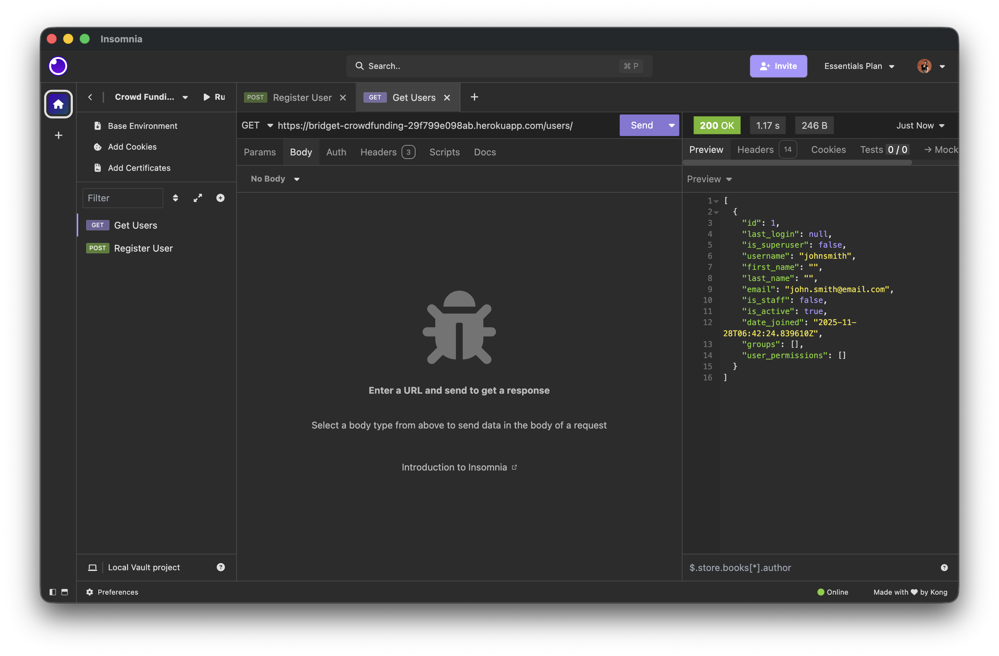
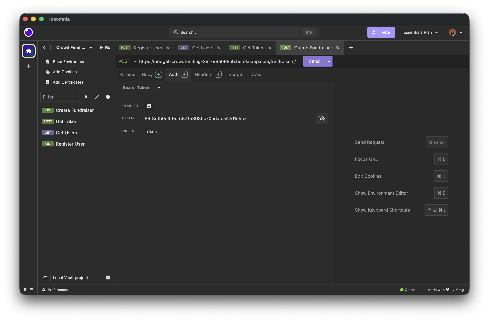
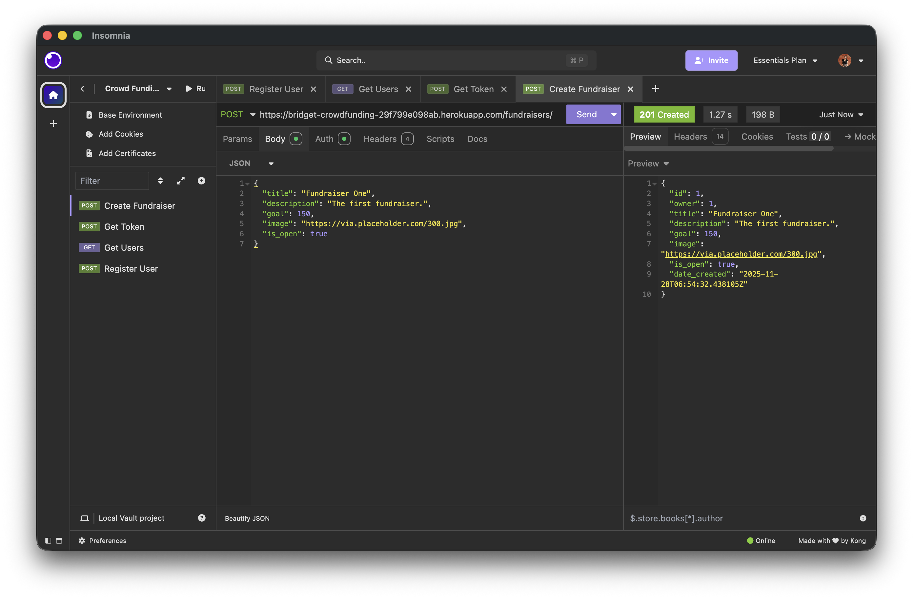
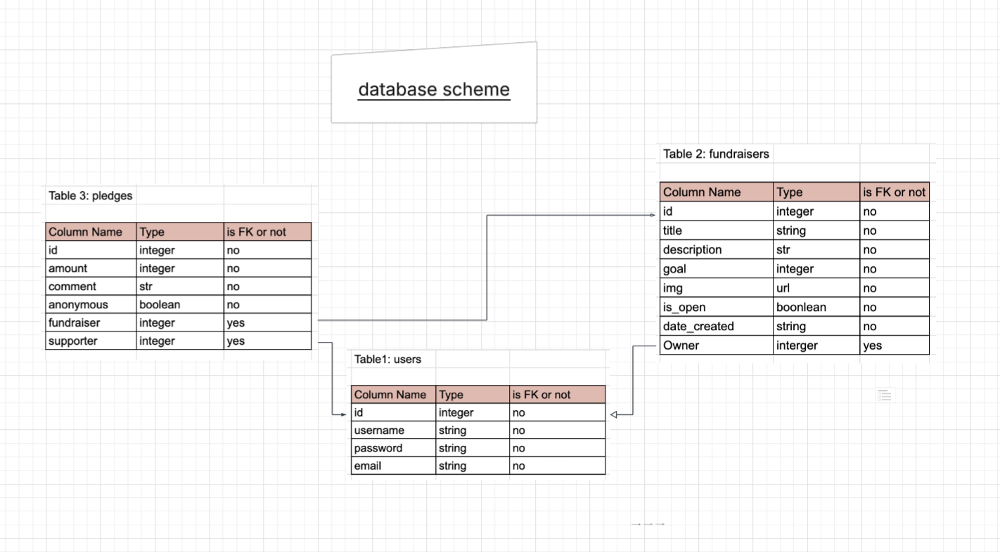

# CrowdFunding Backend

### A link to the deployed project.
[Crowd Funding Backend](https://bridget-crowdfunding-29f799e098ab.herokuapp.com)
### A screenshot of Insomnia, demonstrating a successful GET method for any endpoint.

### A screenshot of Insomnia, demonstrating a successful POST method for any endpoint.

### A screenshot of Insomnia, demonstrating a token being returned.

### Step-by-step instructions for how to register a new user and create a new fundraiser (i.e., endpoints and body data).
* Open Insomnia app
* Create a **POST** request to https://bridget-crowdfunding-29f799e098ab.herokuapp.com/users/
* Switch to the **Body** tab and add a JSON object with the new user's info, like:
    ```json
    {
      "name": "John Smith",
      "username":"johnsmith",
      "email": "john.smith@email.com",
      "password": "A02w94d@k%"
    }
    ```
* Click on the **Send** button to register a new user.
    
* Create a **POST** request to https://bridget-crowdfunding-29f799e098ab.herokuapp.com/api-token-auth/
* Switch to the **Body** tab and add a JSON object with the new user's credential, like:
    ```json
    {
      "username":"johnsmith",
      "password": "A02w94d@k%"
    }
    ```
* Click on the **Send** button to get the new user's token. Take note of the **token** returned. (In this example, the token is **89f3dfb0c4f9cf587153636c70edafea47d1e5c7**)
    
* Create a **POST** request to https://bridget-crowdfunding-29f799e098ab.herokuapp.com/fundraisers/
* Switch to the **Body** tab and add a JSON object with the new fundraiser's info, like:
    ```json
    {
	  "title": "Fundraiser One",
	  "description": "The first fundraiser.",
	  "goal": 150,
	  "image": "https://via.placeholder.com/300.jpg",
	  "is_open": true
    }
    ```
    
* Switch to the **Auth** tab and add a **Bearer Token**.
  * The token value should be the one you got from the previous step. (In this example, the token value is **89f3dfb0c4f9cf587153636c70edafea47d1e5c7**)
  * The prefix is **Token**.
    
* Click on the **Send** button to create a new fundraiser.
    
### Your refined API specification and Database Schema.
* API specification in Swagger format is [here](https://bridget-crowdfunding-29f799e098ab.herokuapp.com/swagger/)
* Database Schema
  * User Table
  
    
  
  * Fundraiser Table
  
    
  
  * Pledge Table
  
    

| URL              | HTTP Method | Purpose                   | Request Body                                                                 | Success Response Code | Authentication/Authorisation |
|------------------|-------------|---------------------------|------------------------------------------------------------------------------|-----------------------|------------------------------|
| users/           | post        | create users              | {"username": string, "password": string, "email":string}                     | http 200 ok           | authentication               |
| fundraisers/     | get         | show all fundraisers      | NO BODY                                                                      | http 200 ok           | authentication               |
| fundraisers/     | post        | create fundraisers        | {"title":string, "description":string, "goal":integer, "is_open": boolean}   | http 200 ok           | authentication               |
| pledges/         | get         | show all pledges          | NO BODY                                                                      | http 200 ok           | authentication               |
| pledges/         | post        | pledge to a fundraiser    | {"amount" : int, "comment": string, "anonymous": boolean, "fundraiser": int} | http 200 ok           | authentication               |
| api-token-auth/  | get         | create token for user     | {"username" : string, "password" : string}                                   | http 200 ok           | authentication               |
| fundraisers/#id/ | put         | change fundraiser details | {"title":string, "description":string, "goal":integer, "is_open": boolean}   | http 200 ok           | authorisation-bear token     |
| pledges/#id/     | put         | change pledge details     | {"amount" : int, "comment": string, "anonymous": boolean, "fundraiser": int} | http 200 ok           | authorisation-bear token     |


### data scheme

